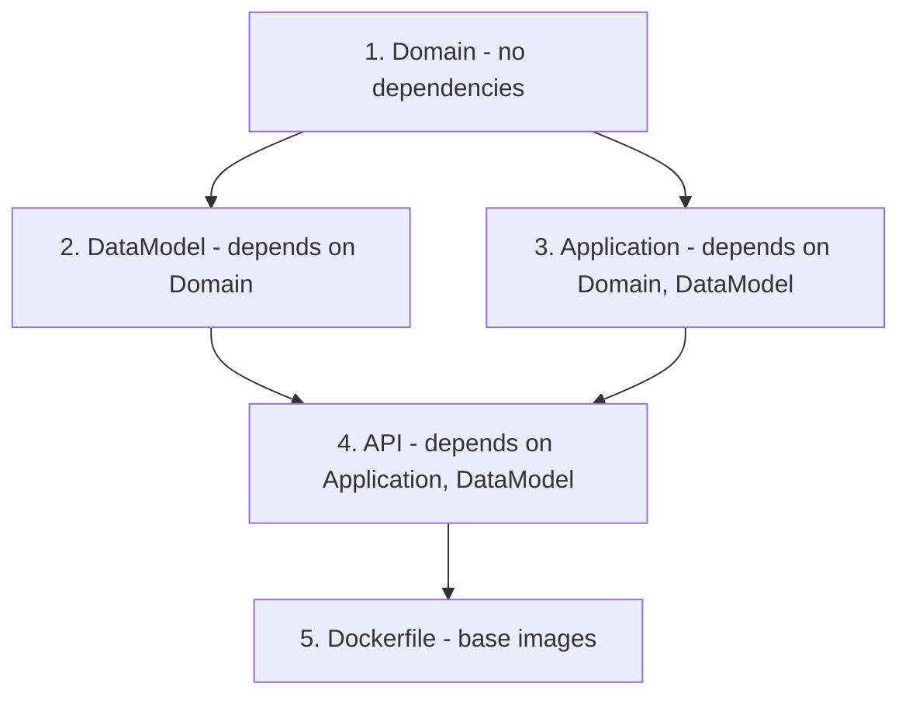

# Design Document

## Overview

This design covers two coordinated changes to the Sample GraphQL API project:

1. **Framework upgrade**: Migrate from .NET 9.0 to .NET 10 across all four projects, update all NuGet dependencies to their latest stable versions, and update the Dockerfile base images.
2. **README rewrite**: Replace the current README.md with a comprehensive, well-structured document that explains GraphQL concepts, the Hot Chocolate integration, the DDD architecture, query examples (select, filtering, pagination), and getting started instructions.

Both changes are low-risk: the upgrade targets an in-memory demo project with no production traffic, and the README is a documentation-only change. The upgrade should be validated with `dotnet build`; the README is validated by visual review.

## Architecture

No architectural changes are introduced. The existing four-layer DDD structure remains intact:

```
API → Application → Domain
API → DataModel  → Domain
```

The upgrade is a horizontal change across all layers (target framework + package versions). The README rewrite is external to the codebase.

### Upgrade Strategy

The upgrade follows a bottom-up dependency order to avoid transient build failures:



Each project's `.csproj` is updated in sequence: target framework first, then NuGet packages. A single `dotnet build` at the solution level validates the entire upgrade.

### README Strategy

The README is rewritten as a single Markdown file at the repository root. It reuses existing screenshot assets in the `assets/` folder. The structure follows a logical reading order: what is this → what technologies → how it's built → how to run it → how to query it.

## Components and Interfaces

### Component 1: Project Files (`.csproj`)

Four project files require updates:

| Project | File | Changes |
|---------|------|---------|
| Domain | `Sample.GraphQL.Domain.csproj` | TFM `net9.0` → `net10.0`, update `Bogus`, `Microsoft.Extensions.DependencyInjection.Abstractions` |
| DataModel | `Sample.GraphQL.Persistence.csproj` | TFM `net9.0` → `net10.0`, update `HotChocolate.Data.EntityFramework`, all `Microsoft.EntityFrameworkCore.*` packages, remove or update `Microsoft.AspNetCore.Http.Abstractions` |
| Application | `Sample.GraphQL.Application.csproj` | TFM `net9.0` → `net10.0`, update `HotChocolate.AspNetCore`, remove `Microsoft.AspNetCore.OpenApi` |
| API | `Sample.GraphQL.API.csproj` | TFM `net9.0` → `net10.0`, remove `Swashbuckle.AspNetCore`, remove `Microsoft.AspNetCore.OpenApi`, update container tools |

### Component 2: Dockerfile

The Dockerfile at `src/Sample.GraphQL.API/Dockerfile` currently references .NET 8.0 base images (already behind the codebase). Both the SDK and runtime images are updated to 10.0.

### Component 3: README.md

The README at the repository root is fully rewritten with the following sections:

1. **Title and badges** — project name
2. **Project overview** — what the API does, key technologies
3. **GraphQL concepts** — what GraphQL is, why Hot Chocolate
4. **Architecture** — DDD layers, dependency direction, conventions
5. **Getting started** — prerequisites, build, run, access playground
6. **Query examples** — basic select, filtering, pagination (with screenshots)
7. **Project structure** — folder layout reference

## Data Models

No data model changes. The domain entities (`MovieEntity`, `ShowtimeEntity`, `ShowtimeSeatEntity`, `Seat`) and the EF Core `CinemaDbContext` remain unchanged.

### NuGet Package Version Mapping

Current → target versions based on research:

| Package | Current | Target | Project(s) |
|---------|---------|--------|------------|
| `Bogus` | 35.6.2 | 35.6.5 | Domain |
| `Microsoft.Extensions.DependencyInjection.Abstractions` | 9.0.2 | 10.0.0 | Domain |
| `HotChocolate.Data.EntityFramework` | 15.0.3 | 15.1.12 | DataModel |
| `Microsoft.EntityFrameworkCore` | 9.0.2 | 10.0.0 | DataModel |
| `Microsoft.EntityFrameworkCore.InMemory` | 9.0.2 | 10.0.0 | DataModel |
| `Microsoft.EntityFrameworkCore.SqlServer` | 9.0.2 | 10.0.0 | DataModel |
| `Microsoft.AspNetCore.Http.Abstractions` | 2.3.0 | Remove (included in shared framework) | DataModel |
| `HotChocolate.AspNetCore` | 15.0.3 | 15.1.12 | Application |
| `Microsoft.AspNetCore.OpenApi` | 9.0.2 | Remove (not needed — only web UI is GraphQL playground) | Application, API |
| `Swashbuckle.AspNetCore` | 7.2.0 | Remove (not needed — only web UI is GraphQL playground) | API |
| `Microsoft.VisualStudio.Azure.Containers.Tools.Targets` | 1.21.2 | latest stable | API |

**Key decisions:**

- **Remove Swashbuckle and OpenAPI entirely**: The only web interface needed is the Hot Chocolate GraphQL playground at `/graphql/`. Swashbuckle, `Microsoft.AspNetCore.OpenApi`, and all Swagger middleware are removed from the project. No replacement (Scalar or otherwise) is added.
- **Hot Chocolate stays on v15**: The latest stable release is 15.1.x. Version 16 is in release candidate and not yet stable. Staying on 15.1.x avoids breaking changes while picking up bug fixes.
- **Remove `Microsoft.AspNetCore.Http.Abstractions`**: This package is included in the ASP.NET Core shared framework since .NET 6. The explicit reference is unnecessary and can be removed.

### Dockerfile Image Mapping

| Stage | Current | Target |
|-------|---------|--------|
| Runtime base | `mcr.microsoft.com/dotnet/aspnet:8.0` | `mcr.microsoft.com/dotnet/aspnet:10.0` |
| Build SDK | `mcr.microsoft.com/dotnet/sdk:8.0` | `mcr.microsoft.com/dotnet/sdk:10.0` |

### Program.cs Changes — Remove Swagger

All Swagger/OpenAPI middleware is removed from `Program.cs`. The only web UI is the Hot Chocolate GraphQL playground, already mapped via `app.MapGraphQL()`.

**Before:**
```csharp
builder.Services.AddEndpointsApiExplorer();
builder.Services.AddSwaggerGen();
// ...
if (app.Environment.IsDevelopment())
{
    app.UseSwagger();
    app.UseSwaggerUI();
}
```

**After:**
```csharp
// Swagger/OpenAPI lines removed entirely.
// The GraphQL playground at /graphql/ is the only web UI.
```

## Error Handling

No new error handling is introduced. The upgrade is a version bump; error handling patterns in the existing code remain unchanged.

**Build validation**: If the upgrade introduces compilation errors (e.g., breaking API changes in EF Core 10 or Hot Chocolate 15.1), they will surface during `dotnet build` and must be resolved before the upgrade is considered complete.

**Dockerfile validation**: The Dockerfile should be validated with `docker build` to confirm the .NET 10 base images resolve correctly and the application compiles inside the container.

## Testing Strategy

**PBT applicability assessment**: Property-based testing is **not applicable** to this feature. The changes consist of:
- Configuration file edits (`.csproj` target frameworks and package versions) — these are declarative, not functional code
- Dockerfile base image updates — infrastructure configuration
- README documentation rewrite — prose content
- A small `Program.cs` cleanup removing Swagger middleware

None of these involve pure functions with varying inputs or universal properties. There is no meaningful "for all inputs X, property P(X) holds" statement to write.

**Recommended testing approach:**

### Build Verification
- Run `dotnet build src/Sample.GraphQL.API.sln` after all `.csproj` changes — must produce zero errors
- Run `dotnet build src/Sample.GraphQL.API.sln --warnaserror` to catch any new warnings introduced by the upgrade

### Runtime Smoke Test
- Start the application with `dotnet run --project src/Sample.GraphQL.API`
- Verify the GraphQL playground loads at `http://localhost:5055/graphql/`
- Execute a basic `all` query and a `showTimes` query with filtering to confirm Hot Chocolate still works

### Dockerfile Validation
- Run `docker build -t sample-graphql-api .` from the `src/` directory
- Verify the image builds without errors

### README Review
- Visual review of the rendered Markdown for formatting, link validity, and image references
- Verify all `assets/*.png` references resolve correctly
