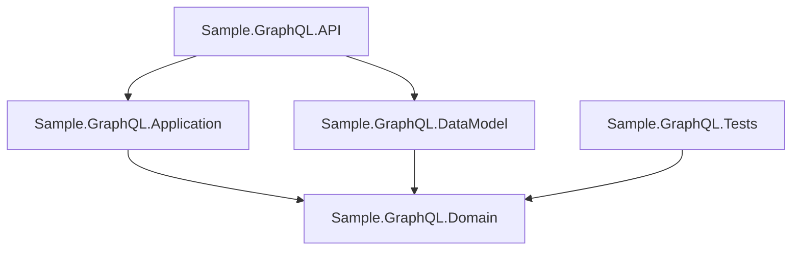

# Design Document

## Overview

This design covers six improvement areas for the Sample GraphQL API project, a .NET 10 cinema showtime management demo built with Hot Chocolate and EF Core InMemory. The improvements are:

1. **HTTP file rewrite** — Replace the stale weatherforecast `.http` file with proper GraphQL queries covering basic selection, filtering, and cursor-based pagination.
2. **Dockerfile removal** — Remove the Dockerfile, `.dockerignore`, and Docker-related csproj properties since the project is a demo with an in-memory database.
3. **Launch settings cleanup** — Remove stale Swagger references, Docker profile, and IIS Express profile; point launch URLs to the GraphQL playground.
4. **NuGet package updates** — Update all packages to latest stable versions (already done: .NET 10, Hot Chocolate 15.1.15, EF Core 10.0.7, DI Abstractions 10.0.7, Bogus 35.6.5).
5. **License audit** — Verify all NuGet dependencies use permissive open-source licenses.
6. **Unit test project** — Create an xUnit test project with tests for domain entity factory methods and business rules.

All changes are scoped to the existing solution structure. No new application features are introduced.

## Architecture

The existing layered architecture remains unchanged:

```
API → Application → Domain
API → DataModel  → Domain
```

The only structural addition is a new test project:

```
src/
├── Sample.GraphQL.API.sln
├── Sample.GraphQL.API/           (host — modified: .http, launchSettings, csproj)
├── Sample.GraphQL.Application/   (unchanged)
├── Sample.GraphQL.Domain/        (unchanged)
├── Sample.GraphQL.DataModel/     (unchanged)
└── Sample.GraphQL.Tests/         (NEW — xUnit test project)
```



The test project references only the Domain project. It tests domain entities in isolation without requiring the API, Application, or Persistence layers.

## Components and Interfaces

### 1. HTTP File (`Sample.GraphQL.API.http`)

The existing `.http` file contains a stale `GET /weatherforecast` request. It will be rewritten with GraphQL POST requests.

**Structure:**
- A `@host` variable set to `http://localhost:5055`
- `###` separators between requests
- All requests use `POST {{host}}/graphql` with `Content-Type: application/json`

**Queries included:**
1. **Basic selection** — `all` query returning `id`, `sessionDate`, `movieId`, and nested `movie { title, stars, releaseDate, imdbId }`
2. **Filtering** — `showTimes` query with `where: { movie: { title: { eq: "Dune Part 1" } } }` demonstrating Hot Chocolate filtering syntax
3. **Pagination (page 1)** — `showTimes(first: 2)` with `totalCount`, `pageInfo { hasNextPage, endCursor }`, `edges { cursor, node { ... } }`
4. **Pagination (page 2)** — `showTimes(first: 2, after: "<cursor>")` demonstrating next-page navigation

### 2. Dockerfile and Docker Configuration Removal

Files to delete:
- `src/Sample.GraphQL.API/Dockerfile`
- `.dockerignore`

Changes to `Sample.GraphQL.API.csproj`:
- Remove `<DockerDefaultTargetOS>Linux</DockerDefaultTargetOS>` from `PropertyGroup`
- Remove `<PackageReference Include="Microsoft.VisualStudio.Azure.Containers.Tools.Targets" Version="1.23.0" />`

**Rationale:** The project is a demo/sample with an in-memory database. Docker adds complexity without value — there is no persistent state, no multi-service orchestration, and no deployment target.

### 3. Launch Settings Cleanup

The `launchSettings.json` will be reduced to two profiles:

```json
{
  "$schema": "http://json.schemastore.org/launchsettings.json",
  "profiles": {
    "http": {
      "commandName": "Project",
      "launchBrowser": true,
      "launchUrl": "graphql",
      "environmentVariables": {
        "ASPNETCORE_ENVIRONMENT": "Development"
      },
      "dotnetRunMessages": true,
      "applicationUrl": "http://localhost:5055"
    },
    "https": {
      "commandName": "Project",
      "launchBrowser": true,
      "launchUrl": "graphql",
      "environmentVariables": {
        "ASPNETCORE_ENVIRONMENT": "Development"
      },
      "dotnetRunMessages": true,
      "applicationUrl": "https://localhost:7196;http://localhost:5055"
    }
  }
}
```

**Removed:**
- `IIS Express` profile and `iisSettings` section
- `Docker` profile
- All `swagger` references in `launchUrl`

### 4. NuGet Package Updates

Current state (updated to .NET 10, all packages at latest stable versions):

| Project | Package | Current Version | License |
|---------|---------|----------------|---------|
| Domain | Bogus | 35.6.5 | MIT |
| Domain | Microsoft.Extensions.DependencyInjection.Abstractions | 10.0.7 | MIT |
| Application | HotChocolate.AspNetCore | 15.1.15 | MIT |
| Persistence | HotChocolate.Data.EntityFramework | 15.1.15 | MIT |
| Persistence | Microsoft.EntityFrameworkCore | 10.0.7 | MIT |
| Persistence | Microsoft.EntityFrameworkCore.InMemory | 10.0.7 | MIT |
| Persistence | Microsoft.EntityFrameworkCore.SqlServer | 10.0.7 | MIT |

**Note:** The Container Tools package (`Microsoft.VisualStudio.Azure.Containers.Tools.Targets`) was removed as part of Docker cleanup in Task 2. All remaining packages are at their latest stable versions as verified by `dotnet list package`.

### 5. License Audit

All current NuGet dependencies use permissive open-source licenses:

| Package | License | Permissive |
|---------|---------|-----------|
| Bogus | MIT | ✅ |
| Microsoft.Extensions.DependencyInjection.Abstractions | MIT | ✅ |
| HotChocolate.AspNetCore | MIT | ✅ |
| HotChocolate.Data.EntityFramework | MIT | ✅ |
| Microsoft.EntityFrameworkCore | MIT | ✅ |
| Microsoft.EntityFrameworkCore.InMemory | MIT | ✅ |
| Microsoft.EntityFrameworkCore.SqlServer | MIT | ✅ |
| xunit (to be added) | Apache 2.0 | ✅ |
| xunit.runner.visualstudio (to be added) | Apache 2.0 | ✅ |
| Microsoft.NET.Test.Sdk (to be added) | MIT | ✅ |
| FsCheck.Xunit (to be added) | BSD-3-Clause | ✅ |

No packages with restrictive or commercial licenses are present.

**Audit verified:** All licenses confirmed via NuGet package metadata and source repository license files (GitHub). Sources checked: [nuget.org](https://www.nuget.org) package license pages, [dotnet/efcore](https://github.com/dotnet/efcore) (MIT), [ChilliCream/graphql-platform](https://github.com/ChilliCream/graphql-platform) (MIT), [bchavez/Bogus](https://github.com/bchavez/Bogus) (MIT), [dotnet/runtime](https://github.com/dotnet/runtime) (MIT), [xunit/xunit](https://github.com/xunit/xunit) (Apache 2.0), [fscheck/FsCheck](https://github.com/fscheck/FsCheck) (BSD-3-Clause), [microsoft/vstest](https://github.com/microsoft/vstest) (MIT).

### 6. Unit Test Project (`Sample.GraphQL.Tests`)

**Project setup:**
- xUnit test project targeting `net10.0`
- Added to `Sample.GraphQL.API.sln`
- References `Sample.GraphQL.Domain`
- Uses FsCheck.Xunit for property-based testing

**Test classes:**

| Class | Tests | Domain Entity |
|-------|-------|--------------|
| `MovieEntityTests` | Factory method property assignment, Id generation, Id uniqueness | `MovieEntity` |
| `ShowtimeEntityTests` | Factory method assignment, null movie rejection, multi-row seat rejection, non-contiguous seat rejection | `ShowtimeEntity` |
| `ShowtimeSeatEntityTests` | Initial state, reservation activation, double-purchase rejection, reserve-after-purchase rejection, cooldown enforcement | `ShowtimeSeatEntity` |

## Data Models

No data model changes. The existing domain entities are:

- **`MovieEntity`** — `Id` (Guid), `Title`, `Stars`, `ImdbId`, `ReleaseDate`. Created via `MovieEntity.Create(title, stars, imdbId, releaseDate)`.
- **`ShowtimeEntity`** — `Id` (Guid), `Movie`, `SessionDate`, `Seats`, `AuditoriumId`. Created via `ShowtimeEntity.Create(movie, sessionDate)`. Has `ReserveSeats(seats)` and `HasBeenPurchased(seats)` methods.
- **`ShowtimeSeatEntity`** — `Id` (Guid), `ShowtimeId`, `Seat`, `ReservationCooldown`, `ReservationTime`, `Purchased`. Created via `ShowtimeSeatEntity.Create(seat, showtimeId)`. Has `SetReserved()` and `SetPurchased()` methods.
- **`Seat`** — Value object record: `Seat(short RowNumber, short SeatNumber)`.

## Correctness Properties

*A property is a characteristic or behavior that should hold true across all valid executions of a system — essentially, a formal statement about what the system should do. Properties serve as the bridge between human-readable specifications and machine-verifiable correctness guarantees.*

### Property 1: MovieEntity.Create() round-trip

*For any* valid title (non-null string), stars (non-null string), imdbId (non-null string), and releaseDate (DateTime), calling `MovieEntity.Create(title, stars, imdbId, releaseDate)` SHALL produce an entity where `Title == title`, `Stars == stars`, `ImdbId == imdbId`, `ReleaseDate == releaseDate`, and `Id != Guid.Empty`.

**Validates: Requirements 10.1, 10.2**

### Property 2: MovieEntity.Create() produces unique Ids

*For any* two calls to `MovieEntity.Create()` with arbitrary valid inputs, the resulting entities SHALL have distinct `Id` values.

**Validates: Requirements 10.3**

### Property 3: ShowtimeEntity.Create() assigns movie and sessionDate

*For any* valid `MovieEntity` and `DateTime` sessionDate, calling `ShowtimeEntity.Create(movie, sessionDate)` SHALL produce an entity where `Movie` is the provided movie and `SessionDate` is the provided date.

**Validates: Requirements 11.1**

### Property 4: ReserveSeats() rejects multi-row seats

*For any* `ShowtimeEntity` and any collection of `Seat` objects spanning two or more distinct `RowNumber` values, calling `ReserveSeats(seats)` SHALL throw `InvalidOperationException`.

**Validates: Requirements 11.3**

### Property 5: ReserveSeats() rejects non-contiguous seats

*For any* `ShowtimeEntity` and any collection of `Seat` objects in the same row where the sorted seat numbers have at least one gap greater than 1, calling `ReserveSeats(seats)` SHALL throw `InvalidOperationException`.

**Validates: Requirements 11.4**

### Property 6: ShowtimeSeatEntity.Create() initializes default state

*For any* valid `Seat` and `Guid` showtimeId, calling `ShowtimeSeatEntity.Create(seat, showtimeId)` SHALL produce an entity where `Purchased == false` and `ReservationTime == null`.

**Validates: Requirements 12.1**

### Property 7: SetReserved() activates reservation time

*For any* newly created `ShowtimeSeatEntity` (not purchased, not previously reserved), calling `SetReserved()` SHALL set `ReservationTime` to a non-null value.

**Validates: Requirements 12.2**

### Property 8: Purchased seat rejects further state changes

*For any* `ShowtimeSeatEntity` that has been purchased, calling `SetPurchased()` SHALL throw `InvalidOperationException`, and calling `SetReserved()` SHALL throw `InvalidOperationException`.

**Validates: Requirements 12.3, 12.4**

## Error Handling

### Domain Entity Validation Errors

| Method | Condition | Exception |
|--------|-----------|-----------|
| `ShowtimeEntity.Create()` | `movie` is null | `ArgumentNullException` |
| `ShowtimeEntity.ReserveSeats()` | Seats span multiple rows | `InvalidOperationException` |
| `ShowtimeEntity.ReserveSeats()` | Seat numbers not contiguous | `InvalidOperationException` |
| `ShowtimeSeatEntity.SetReserved()` | Seat already purchased | `InvalidOperationException` |
| `ShowtimeSeatEntity.SetReserved()` | Within 10-minute cooldown | `InvalidOperationException` |
| `ShowtimeSeatEntity.SetPurchased()` | Seat already purchased | `InvalidOperationException` |

### Build and Configuration Errors

- After Dockerfile removal: `dotnet build` must succeed with zero errors.
- After NuGet updates: `dotnet build` must succeed with zero errors.
- After test project creation: `dotnet test` must discover and run all tests.

## Testing Strategy

### Dual Testing Approach

**Property-based tests** (using FsCheck.Xunit):
- Verify universal properties across randomly generated inputs
- Minimum 100 iterations per property test
- Each test tagged with: `Feature: project-improvements, Property {N}: {description}`
- Cover Properties 1–8 from the Correctness Properties section

**Example-based unit tests** (using xUnit):
- `ShowtimeEntity.Create()` throws `ArgumentNullException` when movie is null (Requirement 11.2)
- `ShowtimeSeatEntity.SetReserved()` throws within 10-minute cooldown (Requirement 12.5)
- These are specific scenarios not suited for property-based testing (null input is a single case; cooldown requires time-dependent setup)

### Test Project Configuration

- **Framework:** xUnit with `Microsoft.NET.Test.Sdk`
- **Property-based testing:** FsCheck.Xunit
- **Target:** `net10.0`
- **Project reference:** `Sample.GraphQL.Domain`

### Test Coverage Matrix

| Requirement | Test Type | Property # |
|-------------|-----------|-----------|
| 10.1, 10.2 | Property | 1 |
| 10.3 | Property | 2 |
| 11.1 | Property | 3 |
| 11.2 | Example | — |
| 11.3 | Property | 4 |
| 11.4 | Property | 5 |
| 12.1 | Property | 6 |
| 12.2 | Property | 7 |
| 12.3, 12.4 | Property | 8 |
| 12.5 | Example | — |

### Non-Code Verification

Requirements 1–9 involve file changes, configuration, and documentation. These are verified by:
- **Build verification:** `dotnet build` succeeds after all changes
- **Test discovery:** `dotnet test` discovers and runs all tests
- **Manual review:** HTTP file content, launchSettings structure, license audit results
