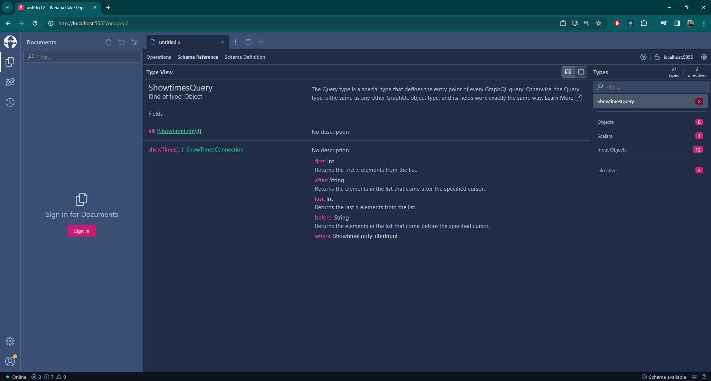
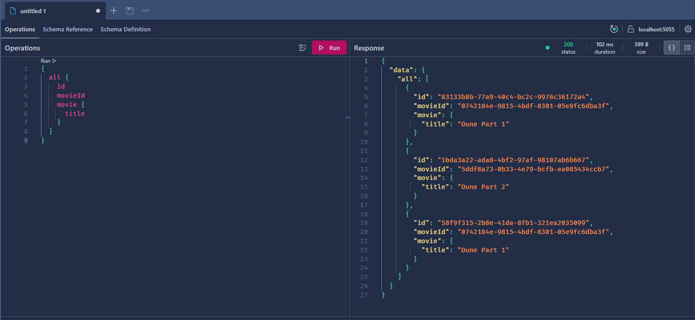
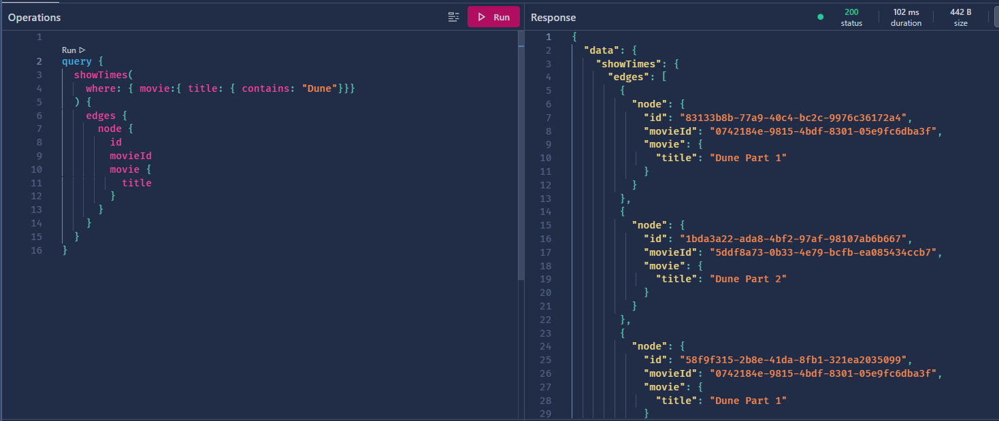
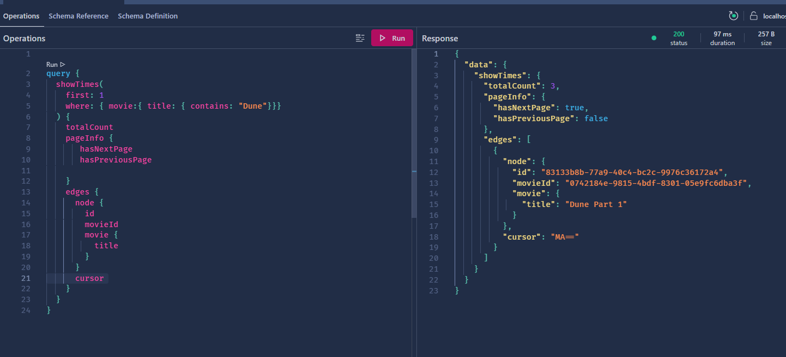
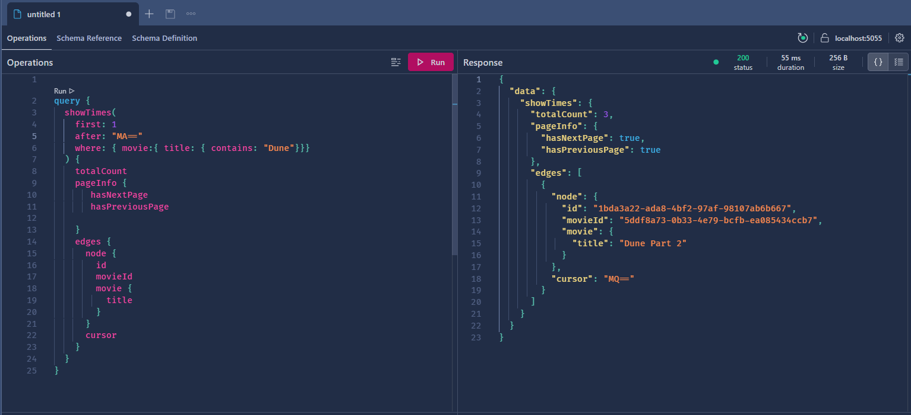

# Sample GraphQL API

A cinema showtime management API built with **ASP.NET Core** and **Hot Chocolate**. The API exposes a GraphQL endpoint for querying movie showtimes, with support for filtering, sorting, and cursor-based pagination. An in-memory database is seeded on startup with sample data, so you can start exploring queries immediately.

## Technologies

| Technology | Purpose |
|---|---|
| **.NET 10** | Runtime and SDK |
| **Hot Chocolate** | Open-source GraphQL server for .NET |
| **Entity Framework Core** | ORM with the **InMemory** provider for zero-setup persistence |
| **Bogus** | Fake data generation for seeding domain entities |

## GraphQL Concepts

**GraphQL** is a query language for APIs that lets clients declaratively specify exactly the data they need. Instead of multiple REST endpoints returning fixed response shapes, a single GraphQL endpoint allows consumers to request only the fields they care about, reducing over-fetching and under-fetching.

**Hot Chocolate** is an open-source GraphQL server for .NET that adheres to the latest GraphQL specifications. It provides a fluent configuration API, a built-in query playground, and first-class support for features like filtering, sorting, and cursor-based pagination through simple C# attributes (`[UseFiltering]`, `[UsePaging]`).

Hot Chocolate integrates with Entity Framework Core through `IQueryable`, which means filtering and pagination expressions are translated into queries executed at the database level rather than in memory. This keeps the API efficient even as the dataset grows.

## Architecture

The solution follows a layered architecture inspired by Domain-Driven Design (DDD), split into four projects:

```
src/
├── Sample.GraphQL.API/          # Host / entry point (Minimal API)
├── Sample.GraphQL.Application/  # Application layer (GraphQL queries + REST endpoints)
├── Sample.GraphQL.Domain/       # Domain layer (entities, repository interfaces)
└── Sample.GraphQL.DataModel/    # Persistence layer (EF Core, repository implementations)
```

### Dependency Direction

```
API → Application → Domain
API → DataModel  → Domain
```

- **API** is the host. It references Application and DataModel, wires up dependency injection, and starts the server.
- **Application** defines GraphQL query types and REST endpoints. It depends on Domain for entity types and repository interfaces.
- **Domain** has no project references. It contains entities, value objects, and repository interfaces — the core of the business logic.
- **DataModel** implements the repository interfaces defined in Domain. It owns the EF Core `DbContext`, entity configurations, and database seeding.

### Key Conventions

- **Private constructors with static factory methods** — Domain entities like `MovieEntity` and `ShowtimeEntity` use private constructors and expose a static `Create()` method for instantiation. This enforces invariants at creation time.
- **Repository interfaces in Domain, implementations in DataModel** — `IShowtimesRepository` is defined in `Domain/Repository/`; its implementation `ShowtimesRepository` lives in `DataModel/Repository/`. This keeps the domain layer free of persistence concerns.
- **Value objects as records** — Simple value types like `Seat` are modeled as C# records.
- **Extension methods for DI registration** — Each layer has a `ServicesExtensions.cs` file that exposes a single `IServiceCollection` extension method (e.g., `AddPersistence()`, `AddPresentationLayer()`), keeping `Program.cs` clean.

## Getting Started

### Prerequisites

- [.NET 10 SDK](https://dotnet.microsoft.com/download/dotnet/10.0)

### Build

```bash
dotnet build src/Sample.GraphQL.API.sln
```

### Run

```bash
dotnet run --project src/Sample.GraphQL.API
```

After the application starts, the **GraphQL Playground** is available at [`http://localhost:5055/graphql/`](http://localhost:5055/graphql/). This is the only web UI provided — there is no Swagger or OpenAPI interface.

Use the playground to explore the schema, write queries, and inspect results interactively.



## Query Examples — Basic Selection

The simplest way to retrieve data is through the `all` query. This endpoint corresponds to the `GetAll` method in `ShowtimesQuery` and returns every showtime in the database without any filtering or pagination.

```graphql
{
  all {
    id
    movieId
    movie {
      title
    }
  }
}
```

The query above retrieves each showtime's `id`, `movieId`, and the nested `movie.title`. Because GraphQL lets you specify exactly which fields you need, you can add or remove fields from the selection set to shape the response.



## Query Examples — Filtering

The `showTimes` endpoint supports filtering through the `where` clause. Filtering is enabled by the `[UseFiltering]` attribute on the `GetShowTimes` method in `ShowtimesQuery`. You can filter on any field, including nested entities like `movie.title`.

```graphql
{
  showTimes(
    where: { movie: { title: { eq: "Dune" } } }
  ) {
    edges {
      node {
        id
        movie {
          title
        }
      }
    }
  }
}
```

This query returns only showtimes whose movie title equals `"Dune"`.



For the full list of filter operators and advanced usage, see the [Hot Chocolate filtering documentation](https://chillicream.com/docs/hotchocolate/v13/fetching-data/filtering).

## Query Examples — Pagination

The `showTimes` endpoint also supports cursor-based pagination, enabled by the `[UsePaging]` attribute on the `GetShowTimes` method in `ShowtimesQuery`. Cursor-based pagination uses opaque cursors instead of page numbers, which provides stable navigation even when the underlying data changes.

### First Page

Request the first 2 items and include pagination metadata:

```graphql
{
  showTimes(first: 2) {
    totalCount
    pageInfo {
      hasNextPage
      endCursor
    }
    edges {
      cursor
      node {
        id
        movie {
          title
        }
      }
    }
  }
}
```

The response includes `totalCount` (total number of items), `pageInfo.hasNextPage` (whether more items exist), and `pageInfo.endCursor` (the cursor to use for the next page). Each edge contains a `cursor` and the `node` data.



### Next Page

To fetch the next page, pass the `endCursor` value from the previous response as the `after` parameter:

```graphql
{
  showTimes(first: 2, after: "MA==") {
    totalCount
    pageInfo {
      hasNextPage
      endCursor
    }
    edges {
      cursor
      node {
        id
        movie {
          title
        }
      }
    }
  }
}
```

Replace `"MA=="` with the actual `endCursor` value from your first page response. Continue passing the latest `endCursor` to navigate through the full result set.



For more on cursor-based pagination in GraphQL, see the [official GraphQL pagination documentation](https://graphql.org/learn/pagination/).
